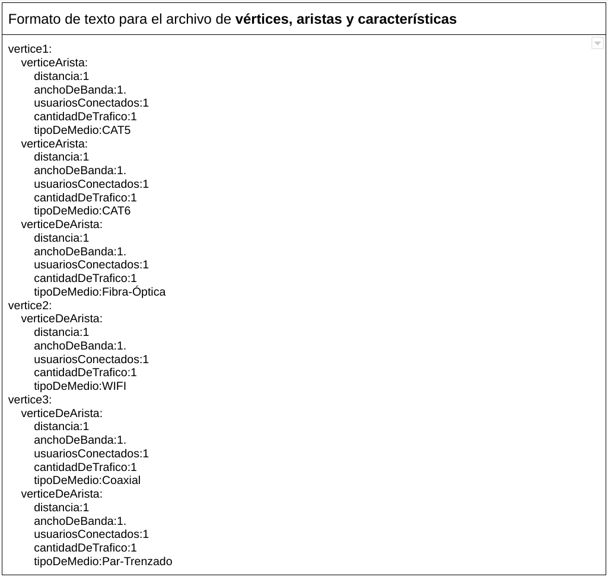
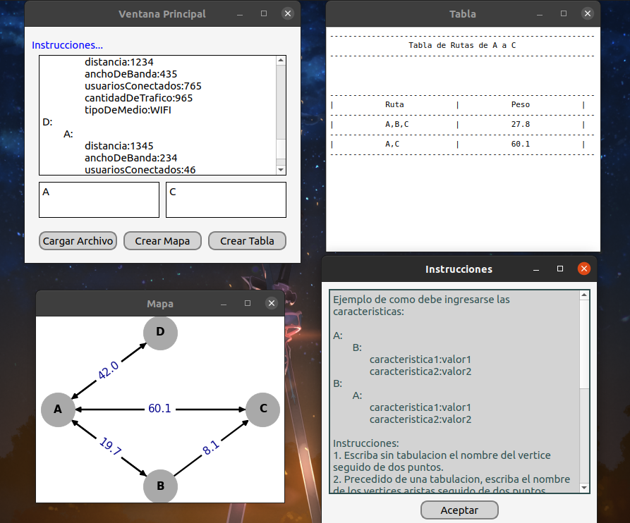

# **Interconnected Servers Application**

## Objetivo: 

* Crear un programa GUI en Python3 con Qt5 para Linux que permita recibir un texto plano con la información de los vértices, aristas y características entre nodos para una “**red de servidores interconectados**” para producir:
 
    * Un mapa de nodos y arcos con el contenido cargado. Esta debe ser una imagen embebida dentro de una nueva ventana emergente que debe aparecer al presionar el botón de generar el grafo.
    * Una tabla de rutas con pesos ordenada ascendentemente. Esta debe ser una tabla ASCII generada dentro de un campo de texto de múltiples líneas, campo que debe estar embebido en una nueva ventana emergente que debe aparecer al presionar el botón de generar la tabla.
    * En la pantalla principal se debe pedir un vértice origen y uno destino sobre los cuales se podrá generar la tabla de rutas.
    * La creación de Mapas deberá realizarse con la librería MatPlotLib.
    * El programa GUI debe cargar el archivo mediante:
        1. Un Dialog Box.
        1. Mediante un campo de texto de múltiples líneas donde será posible escribir el texto plano con la información de vértices, aristas y características, usando el siguiente formato:
        
        * **NOTA**: El archivo seleccionado mediante dialog box debe cargarse directamente en la caja de texto de múltiples líneas.

* Las características que debe contener cada arista son (**NOTA**: las observaciones a continuación se han fabricado específicamente para este proyecto):

    * Distancia entre nodos (en metros).
    * Ancho de banda disponible entre nodos (en Mbps).
    * Cantidad de usuarios conectados entre el server (número entero positivo).
    * Cantidad de tráfico que cruza actualmente por la red (en Mbps).
    * Tipo de medio (medio de transmisión) que conecta ambos nodos (eg. CAT5, CAT6, Fibra-Óptica, WIFI, Coaxial, Par-Trenzado)
    * Confiabilidad del medio: Cada tipo de medio presenta un valor de confiabilidad entre 0 y 1, siendo 0 poco confiable y siendo 1 muy confiable:

        1. CAT5: confiabilidad 0.98.
        1. CAT6: confiabilidad 0.98.
        1. Fibra-Óptica: confiabilidad 0.90.
        1. WIFI: 0.7.
        1. Coaxial: 1.
        1. Par-Trenzado: 1.
    * Cada metro de distancia la confiabilidad del tipo de medio (medio de transmisión) se ve afectada de acuerdo con:
        1. CAT5: disminuye 0.02% de confiabilidad por cada 50 metros.
        1. CAT6: disminuye 0.01% de confiabilidad por cada 50 metros.
        1. Fibra-Óptica: disminuye 0.05% de confiabilidad por cada 100 metros.
        1. WIFI: disminuye 0.6% de confiabilidad por cada 6 metros.
        1. Coaxial: disminuye 0.04% de confiabilidad por cada 100 metros.
        2. Par-Trenzado: disminuye 0.01% de confiabilidad por cada 100 metros.

## **Visualización del Proyecto Terminado**
